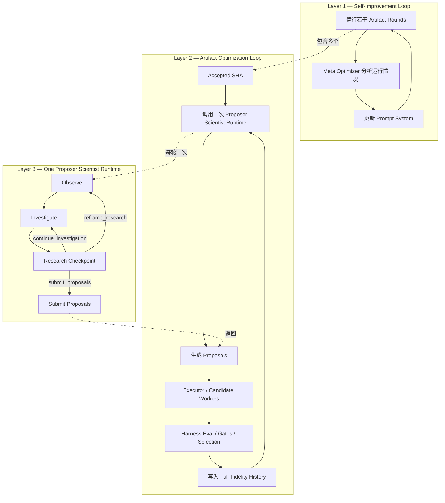
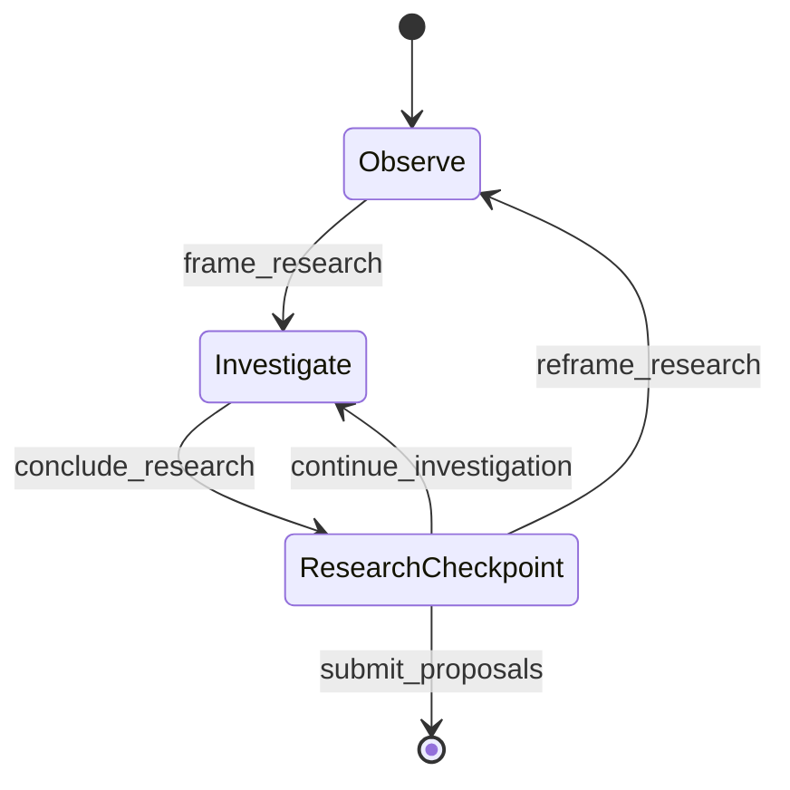
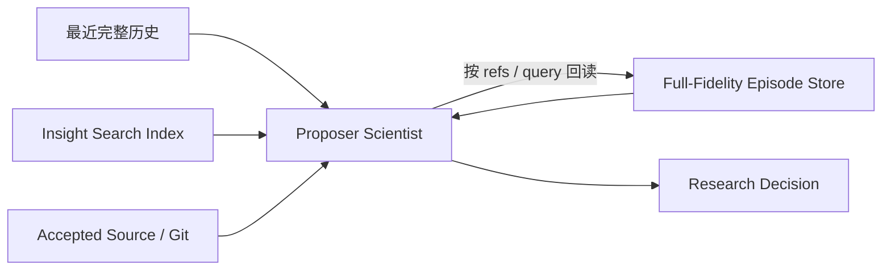

# SimpleLoop Proposer Scientist Runtime MVP 设计文档

## 1. 文档目的

本文定义 SimpleLoop 中 Proposer Runtime 的下一阶段最小可行改造方案。

目标不是重构 Harness，也不是重新引入 Judger，而是把当前容易退化为“读几处代码后快速提交 proposal”的 mini Claude Code，改造成一个真正具备科学研究行为的 **Proposer Scientist Agent**。

核心原则：

> Observe、Investigate、Research Checkpoint 是同一个 Scientist 在同一次 runtime 中的不同认知状态，不是三个 Agent，也不是三个串行角色。

整个改造必须保持以下架构边界：

- 每个 round 只调用一次 Proposer Runtime。
- 下一轮 Proposer 直接读取上一轮 Harness 的原始事实。
- 不增加 `assimilate_round()`。
- 不增加 Judger、Reflection Agent、Memory Agent 或其他中间解释节点。
- 不改变 Executor、CandidateWorker、Gate 和 winner selection 的职责。
- Insight 只作为 Search Memory 的检索索引，不作为事实源。
- 旧实验的完整事实始终保存在 full-fidelity episode history 中，Proposer 按需回读。

---

## 2. 当前问题

当前 Proposer 已经从 `claude -p` 改为由 SimpleLoop 自己控制的 Agent Runtime，但其实际行为仍然接近一个只读版 coding agent：

```text
读取少量源码
→ 找到一个可疑热点
→ 快速提交 proposal
```

主要原因不是模型能力不足，而是 Runtime Contract 仍然鼓励最短路径：

- `submit_proposals` 可以过早调用；
- Agent 没有必须维护的研究进度；
- `write_insight` 是可选旁路；
- 历史、实验结果和源码没有在一个明确的研究流程中被共同观察；
- Runtime 没有区分“证据不足”和“问题定义错误”；
- Agent 可以把第一次看到的代码机会直接当成最终 proposal。

因此，当前系统虽然已经 Agent Runtime 化，但还没有完成 Research Process 的 Agent 化。

---

## 3. 设计目标

### 3.1 主要目标

让 Proposer 在同一次 runtime 内完成一个可循环的科学研究过程：

```text
Observe
→ Investigate
→ Research Checkpoint
   ├─ submit_proposals
   ├─ continue_investigation
   └─ reframe_research
```

Proposer 必须能够：

1. 观察最近实验历史、Harness 原始结果、Insight 索引和当前 accepted source；
2. 从观察中界定本轮真正值得研究的问题；
3. 围绕研究问题主动查证，而不是只围绕代码文件闲逛；
4. 在证据不足时继续调查；
5. 在问题定义错误时重新观察和重构问题；
6. 只有在有足够依据时才提交 proposal；
7. 决定本轮是否产生值得未来检索的 Insight 索引。

### 3.2 非目标

本 MVP 不做以下事情：

- 不增加实验后的第二次 Scientist 调用；
- 不增加 `assimilate_round()`；
- 不重新引入 Judger；
- 不设计 Observer / Investigator / Decider 三个 Agent；
- 不引入多 Agent debate；
- 不引入 hypothesis graph；
- 不引入复杂 ResearchState；
- 不引入外部论文搜索；
- 不引入 tree search；
- 不改造 Harness 的事实裁决逻辑；
- 不改变 Executor 的角色边界；
- 不改变 candidate selection；
- 不要求每轮强制生成 Insight；
- 不规定最低工具调用次数；
- 不要求每轮扫描全部源码或全部历史。

---

## 4. 总体架构

SimpleLoop 继续保持三层嵌套结构：

```text
Self-Improvement Loop
    ↓
Artifact Optimization Loop
    ↓
Proposer Scientist Runtime
```

其中本次只修改第三层。



---

## 5. 最关键的架构原则：状态机，而不是三个 Agent

Observe、Investigate、Research Checkpoint 必须属于：

- 同一个 Scientist identity；
- 同一个 system prompt；
- 同一个 messages 上下文；
- 同一份本轮 working state；
- 同一套研究工具；
- 同一次 runtime；
- 同一个模型会话。

正确实现：

```text
One Scientist
One Session
One Message History
One Shared Working State
Multiple Internal Phases
```

错误实现：

```python
observation = observe_agent.run(context)
investigation = investigate_agent.run(observation)
decision = decide_agent.run(investigation)
```

上述错误实现本质上会退化成：

```text
Observer → Investigator → Decider
```

并重新产生：

- 信息压缩；
- 阶段间交接；
- 职责越界；
- 二手解释；
- 上游选择性传递；
- 下游只能看到摘要；
- 类 Judger 信息瓶颈。

因此，阶段切换只能是 runtime 内部状态转换，不能是 Agent 调用边界。

---

## 6. Proposer Scientist 状态机

### 6.1 状态图



### 6.2 Observe

Scientist 当前主要回答：

- 发生了什么？
- 最近实验结果说明了什么？
- 哪些旧实验可能相关？
- 当前 accepted source 的真实状态是什么？
- 当前最重要的未知是什么？
- 哪个问题值得消耗本轮研究预算？

观察对象不限于源码，而是整个实验空间：

```text
最近全真历史
+ Harness 原始结果
+ Insight 索引
+ 按需回读的旧 episode
+ 当前 accepted source
+ Git diff
+ Goal / Gates / objective
```

Observe 不是一个只读角色限制。Scientist 可以形成初步假设、发现历史冲突、质疑已有 Insight、回读旧 episode、阅读源码和比较实验结果。

但在形成研究问题前，不能直接提交 proposal。

终止 Observe 的控制动作：

```text
frame_research
```

### 6.3 Investigate

Scientist 围绕已界定的问题降低关键不确定性。

核心问题是：

- 我需要什么证据才能区分当前解释？
- 哪些旧实验已经部分回答了这个问题？
- 历史结果和当前源码是否一致？
- 当前证据是否支持消耗一次实验预算？
- 是否需要重构最初的问题？

Scientist 可以继续搜索历史、根据 Insight 定位旧 episode、回读完整 episode、比较多个候选、查看原始 diff、阅读 accepted source、运行只读研究命令、修改初始研究判断并发现新的观察。

终止 Investigate 的控制动作：

```text
conclude_research
```

该动作表示 Scientist 暂时认为已有足够信息进入研究检查点，但不代表必须提交 proposal。

### 6.4 Research Checkpoint

Research Checkpoint 不是第三个角色，也不是最终裁决 Agent。

它只是同一个 Scientist 暂停下来判断：

> 当前是否已经有充分理由花费一次实验预算？

可选动作：

```text
submit_proposals
continue_investigation
reframe_research
```

含义：

- `submit_proposals`：已有足够依据，结束 runtime；
- `continue_investigation`：研究问题仍合理，但证据不足；
- `reframe_research`：原问题或研究框架本身错误，需要重新观察。

只有 `submit_proposals` 才是对外终止动作。

---

## 7. 有机结合要求

### 7.1 不拆会话

所有状态共享完整的 messages：

```text
initial context
+ model actions
+ tool observations
+ frame_research
+ investigation records
+ checkpoint decisions
```

状态转换不得清空上下文，不得启动新会话。

### 7.2 不换身份

始终使用统一身份：

```text
You are the Researcher / Proposer Scientist.
```

禁止阶段化身份：

```text
You are now the Observer.
You are now the Investigator.
You are now the Decider.
```

### 7.3 不做中间摘要交接

禁止接口：

```python
observe() -> ObservationReport
investigate(ObservationReport) -> InvestigationReport
decide(InvestigationReport) -> Proposal
```

推荐接口：

```python
scientist.step(
    shared_messages,
    working_state,
    current_phase,
) -> Action
```

`frame_research` 和 `conclude_research` 只是同一 Scientist 的内部工作记录，不是新的事实源，也不是供另一个 Agent 消费的交接文档。

### 7.4 阶段是认知重心，不是工具隔离

Observe 可以读源码和形成假设。

Investigate 可以重新观察和修改问题。

Checkpoint 可以回退。

状态机限制的是：

```text
过早终止
```

而不是限制正常的科研认知行为。

---

## 8. 长程记忆设计

### 8.1 三层记忆结构

```text
1. Recent Full History
   最近若干轮完整事实直接进入初始上下文

2. Insight Search Index
   稀疏、可检索、指向旧 episode 的长期索引

3. Full-Fidelity Episode Store
   所有历史实验的完整原始事实
```

### 8.2 信息流



### 8.3 Insight 的定位

Insight 是：

```text
pointer + retrieval cue
```

不是：

```text
compressed truth
```

Insight 的作用是帮助未来 Proposer回答：

- 过去是否做过类似实验？
- 哪些旧 episode 可能相关？
- 哪些方向值得重新核查？
- 哪些实验结果存在冲突？
- 哪段旧历史可能解释当前问题？

### 8.4 Full-Fidelity History 是唯一事实源

任何关于以下内容的判断都必须可以回溯到原始 episode：

- proposal；
- parent SHA；
- candidate SHA；
- diff；
- changed paths；
- evaluation output；
- metrics；
- Gate results；
- selected status；
- eligible status。

Insight 不具有事实裁决权。

### 8.5 Insight 示例

```yaml
id: I-017
text: >
  QPDF lookup hoist 曾出现明显收益，而扩大通用指针缓存没有稳定改善。
  当再次研究 QPDF 热路径、lookup 或 caching 时，应回看这些实验。
refs:
  - r3c0
  - r4c1
tags:
  - qpdf
  - lookup
  - caching
  - performance
```

未来 Proposer 应执行：

```text
读取 Insight
→ 得到 r3c0 / r4c1
→ inspect_episode
→ 查看原始事实
→ 自己形成当前判断
```

不得直接把 Insight 文本当成最终结论。

---

## 9. Insight 管理原则

MVP 不要求每轮必须创建 Insight。

Scientist 在终止前必须显式决定：

```text
save insight
or
no insight
```

长期来看可以支持 create、update、supersede 和 no_change，但 MVP 只保留：

```text
save
no_change
```

Insight 适合保存：

- 能帮助未来检索旧实验的方向索引；
- 需要跨轮保留的冲突线索；
- 已有实验族的定位入口；
- 未来遇到特定机制时应回看的 episode refs。

Insight 不适合保存：

- 本轮全部历史复述；
- 未经原始 episode 支持的性能结论；
- 对未来 Proposer 的硬性禁止；
- 临时猜测；
- 本轮尚未经过实验的细节；
- 冗长的 reasoning transcript。

Insight 应是导航信息，不是压缩后的 Judger 结论。

---

## 10. Action Protocol

### 10.1 研究工具动作

继续复用现有能力：

```text
search_history
inspect_episode
run_research_command
```

可保留现有 `write_insight` 一段时间，但推荐逐步合并进终止动作的 memory update。

### 10.2 `frame_research`

用于从 Observe 进入 Investigate。

```json
{
  "action": "frame_research",
  "observations": [
    "最近两轮 QPDF pointer caching 均通过 Gate，但没有稳定改善 SPEED_MS。",
    "当前 accepted source 中仍有 bin lookup 位于事件内层循环。"
  ],
  "research_questions": [
    "剩余成本主要来自重复 lookup，还是数据访问 locality？",
    "历史候选是否已经间接区分了这两个解释？"
  ]
}
```

要求：

- 指出当前重要观察；
- 指出关键知识缺口；
- 不要求固定数量；
- 不要求固定工具调用次数；
- 不要求完整源码扫描。

### 10.3 `conclude_research`

用于从 Investigate 进入 Research Checkpoint。

```json
{
  "action": "conclude_research",
  "findings": [
    "R3 hoist lookup 获得明显改善，说明 lookup 是真实成本来源。",
    "R4 扩大缓存没有改善，并增加间接访问。",
    "当前源码中另一组重复 lookup 尚未处理。"
  ],
  "remaining_uncertainty": [
    "收益大小仍不确定，但可以由一轮实验直接检验。"
  ],
  "decision_basis": "应测试未处理的重复 lookup，而不是继续扩大指针缓存。"
}
```

### 10.4 `continue_investigation`

用于证据不足但问题仍有效。

```json
{
  "action": "continue_investigation",
  "gap": "尚未确认旧候选是否已经测试过同类机制。",
  "next_question": "哪些历史 episode 修改过该循环，它们的真实结果是什么？"
}
```

### 10.5 `reframe_research`

用于原研究框架被否定。

```json
{
  "action": "reframe_research",
  "reason": "历史和当前 profile 均表明 QPDF 已不再是主要热点。",
  "observation_scope": "重新比较当前性能账本、近期成功候选和 accepted source 的其他剩余热点。"
}
```

### 10.6 `submit_proposals`

唯一终止动作。

```json
{
  "action": "submit_proposals",
  "proposals": [
    "Hoist the remaining repeated QPDF bin lookup outside the event-inner loop while preserving the existing floating-point evaluation order."
  ],
  "memory_update": {
    "mode": "save",
    "text": "QPDF lookup 是已验证成本来源，但扩大通用指针缓存没有稳定收益；再次研究该区域时应优先检查尚未处理的 lookup。",
    "refs": ["r3c0", "r4c1"]
  }
}
```

无新 Insight 时：

```json
{
  "action": "submit_proposals",
  "proposals": ["..."],
  "memory_update": {
    "mode": "no_change",
    "reason": "本轮没有形成值得跨轮检索的新索引。"
  }
}
```

---

## 11. 状态转换规则

| 当前状态 | Action | 下一状态 |
|---|---|---|
| Observe | research tools | Observe |
| Observe | `frame_research` | Investigate |
| Investigate | research tools | Investigate |
| Investigate | `conclude_research` | Research Checkpoint |
| Research Checkpoint | `continue_investigation` | Investigate |
| Research Checkpoint | `reframe_research` | Observe |
| Research Checkpoint | `submit_proposals` | Runtime Exit |

非法转换示例：

- Observe 直接 `submit_proposals`；
- Observe 直接 `conclude_research`；
- Investigate 直接 `submit_proposals`；
- 未进入 Checkpoint 就退出。

非法动作应返回协议错误，并允许有限次数修复。

---

## 12. Working State

MVP 只需要轻量本轮状态，不引入复杂长期 ResearchState。

```python
from dataclasses import dataclass, field
from enum import Enum


class ResearchPhase(str, Enum):
    OBSERVE = "observe"
    INVESTIGATE = "investigate"
    CHECKPOINT = "checkpoint"


@dataclass
class WorkingState:
    phase: ResearchPhase = ResearchPhase.OBSERVE
    research_frame: dict | None = None
    research_conclusion: dict | None = None
    open_questions: list[str] = field(default_factory=list)
    evidence_refs: list[str] = field(default_factory=list)
    investigation_gap: str | None = None
    reframe_count: int = 0
```

这些字段只服务于本次 runtime。Runtime 结束后可以丢弃。

长期持久化的仍然只有：

```text
Full-Fidelity History
Insight Search Index
```

---

## 13. Runtime 伪代码

```python
def run_proposer_runtime(context, tools, model, limits):
    messages = build_initial_messages(context)
    state = WorkingState()

    while limits.within_budget():
        action = model.complete(
            system_prompt=PROPOSER_SCIENTIST_PROMPT,
            messages=messages,
            runtime_state={
                "phase": state.phase.value,
                "research_frame": state.research_frame,
                "open_questions": state.open_questions,
                "investigation_gap": state.investigation_gap,
            },
        )

        validate_action_schema(action)
        validate_phase_transition(state.phase, action)

        messages.append({
            "role": "assistant",
            "content": serialize(action),
        })

        if action.type in RESEARCH_TOOL_ACTIONS:
            result = tools.execute(action)
            messages.append({
                "role": "tool",
                "content": serialize(result),
            })
            update_evidence_refs(state, action, result)
            continue

        if action.type == "frame_research":
            state.research_frame = action.payload
            state.open_questions = action.research_questions
            state.phase = ResearchPhase.INVESTIGATE
            continue

        if action.type == "conclude_research":
            state.research_conclusion = action.payload
            state.phase = ResearchPhase.CHECKPOINT
            continue

        if action.type == "continue_investigation":
            state.investigation_gap = action.gap
            state.open_questions = [action.next_question]
            state.phase = ResearchPhase.INVESTIGATE
            continue

        if action.type == "reframe_research":
            state.research_frame = None
            state.research_conclusion = None
            state.investigation_gap = None
            state.open_questions = []
            state.reframe_count += 1
            state.phase = ResearchPhase.OBSERVE
            continue

        if action.type == "submit_proposals":
            memory_update = validate_memory_update(action.memory_update)
            return ProposerResult(
                proposals=action.proposals,
                memory_update=memory_update,
                trace=messages,
            )

    return handle_budget_exhaustion(messages, state)
```

---

## 14. Budget 与无限循环控制

状态机允许回退，但不能无限运行。

继续保留：

- `max_steps`；
- runtime deadline；
- command timeout；
- command output limit；
- protocol repair limit。

不要规定：

- 至少调用几个工具；
- 每个阶段最少几步；
- 必须读取多少文件；
- 必须回读多少 episode。

这些规则容易诱导工具刷步。

接近预算上限时，可以向同一个 Scientist 注入轻量提醒：

```text
Research budget is nearly exhausted.
Use the evidence already gathered to choose one of:
- submit the strongest justified proposals;
- continue only if one concrete unanswered question can still be resolved within budget.
```

MVP 可暂时保持当前必须返回 proposal 的 contract。

是否支持正式 `no_proposal`，应等实际运行中出现大量低质量兜底 proposal 后再决定。

---

## 15. 与 Loop、Harness 的边界

### 15.1 下一轮直接读取上一轮原始事实

保持：

```text
Round N Harness Results
        ↓
Round N+1 Proposer Scientist
```

禁止：

```text
Round N Harness Results
        ↓
Assimilation Agent
        ↓
Summary / Judgement
        ↓
Round N+1 Proposer
```

### 15.2 Harness 继续掌握事实权

Harness 负责：

- Eval；
- Gate；
- objective；
- candidate eligibility；
- winner selection；
- episode persistence。

Scientist 不负责：

- 宣布 Gate 通过；
- 修改 objective；
- 判断 candidate 合法；
- 推进 accepted SHA；
- 替代 Harness 写事实。

### 15.3 Executor 边界不变

Executor 继续负责：

- 实现 proposal；
- 调查完整调用点；
- 局部验证；
- 在可编辑范围内修改代码。

Executor 不负责：

- 选择研究问题；
- 否决 proposal；
- 解释全局历史；
- 管理 Insight；
- 修改研究方向。

---

## 16. 最小代码改动范围

### 16.1 `roles/proposer.py`

新增：

- `ResearchPhase`；
- `WorkingState`；
- phase-aware action validation；
- transition logic；
- `frame_research`；
- `conclude_research`；
- `continue_investigation`；
- `reframe_research`；
- terminal `memory_update`。

保持：

- 单次 `run()`；
- 单一 messages；
- 单一 system prompt；
- 现有 model client；
- 现有 tool execution loop；
- 现有 deadline 和 step budget。

### 16.2 `roles/research_tools.py`

尽量不增加重量级工具。

继续复用：

- `search_history`；
- `inspect_episode`；
- `run_research_command`。

控制动作不需要进入 tools 层，可以由 Proposer Runtime 直接处理。

Insight 持久化可以继续复用当前 `InsightStore`。

### 16.3 `prompts/proposer.md`

只保留一个统一 Scientist prompt。

Prompt 应表达：

- Scientist 负责发展和修正研究认识；
- 观察对象包括历史、结果、Insight 和源码；
- Insight 是检索索引，不是事实；
- 应围绕关键知识缺口调查；
- Checkpoint 可继续调查或重构问题；
- 不应为了走流程而机械制造观察或 Insight；
- 不应把阶段理解成独立角色。

不要拆成：

```text
observe_prompt.md
investigate_prompt.md
decide_prompt.md
```

### 16.4 不改动

本 MVP 不改：

- `loop.py` 的每轮调用次数；
- `candidate_worker.py`；
- Executor；
- Gate；
- objective selection；
- winner selection；
- Self-Improvement Supervisor；
- Harness episode schema，除非需要补充已有 episode 查询字段。

---

## 17. Prompt 设计原则

Prompt 不应写成机械 checklist。

错误：

```text
Step 1: read three history records.
Step 2: inspect five files.
Step 3: write one insight.
Step 4: propose.
```

正确：

> Work as one continuous researcher. First establish the current research situation from the accepted source, recent factual outcomes, relevant historical episodes, and the Insight index. Investigate the most consequential uncertainty. At a research checkpoint, either submit experiments, continue investigating a concrete evidence gap, or reframe the problem if the original framing no longer holds.

Prompt 负责身份与认知方式。

Runtime 负责：

- 不允许过早退出；
- 保持共享状态；
- 验证状态转换；
- 控制预算；
- 保障只有一个终止动作。

---

## 18. 风险

### 18.1 科研仪式化

表现：

- `frame_research` 只是复述输入；
- `conclude_research` 只是改写 proposal；
- Agent 为过状态而生成空话。

缓解：

- 不规定固定字段长度；
- 不要求最低工具次数；
- ablation 中检查阶段文本是否引用真实 episode、metrics 或源码；
- 只用最终优化效果决定设计是否保留。

### 18.2 无休止调查

表现：

- 反复 `continue_investigation`；
- 一直声明证据不足；
- 工具调用很多但没有收敛。

缓解：

- 保留 max_steps 和 deadline；
- `continue_investigation` 必须给出具体 gap 和 next question；
- 记录连续 checkpoint 回退次数；
- 在预算接近耗尽时提醒收敛。

### 18.3 反复 reframe

表现：

- 每遇到一点反例就重新 Observe；
- 研究方向频繁漂移。

缓解：

- 记录 `reframe_count`；
- `reframe_research` 必须说明原 framing 被什么证据推翻；
- 评估 reframe 是否实际带来更高 proposal 多样性或 accepted improvement。

### 18.4 Insight 污染

表现：

- 保存大量未经验证的猜测；
- Insight 变成长摘要；
- 未来 Proposer 直接相信 Insight。

缓解：

- Insight 必须带 episode refs；
- Prompt 明确 Insight 仅作索引；
- 未来使用 Insight 时鼓励回读原始 episode；
- 限制 Insight 数量和长度；
- 允许 `no_change`。

### 18.5 状态机再次角色化

表现：

- 为三个 phase 创建不同 prompt；
- 各阶段启动不同模型调用；
- 阶段间传递摘要；
- 出现 Observer / Investigator / Decider 职责表。

缓解：

把以下要求作为硬架构测试：

```text
one runtime
one messages list
one system prompt
one Scientist identity
no inter-phase summary handoff
```

---

## 19. Ablation 设计

必须验证流程化是否真的改善研究，而不是只让 trace 看起来更像科学研究。

### 19.1 对照组

#### A：当前 Free-Form Runtime

```text
tools
→ optional insight
→ submit_proposals
```

#### B：Scientist State Machine

```text
Observe
→ Investigate
→ Research Checkpoint
   ↺ continue / reframe
→ submit_proposals
```

### 19.2 固定条件

两组保持一致：

- task；
- 初始 SHA；
- model；
- temperature；
- candidates per round；
- total token budget；
- max runtime；
- Executor；
- Harness；
- Gate；
- objective；
- selection policy。

### 19.3 过程指标

- 提交 proposal 前平均 model steps；
- 历史工具使用率；
- `inspect_episode` 使用率；
- 同时引用历史和源码的比例；
- Insight 保存率；
- Insight 被后续轮检索的比例；
- 旧 episode 回读率；
- `continue_investigation` 次数；
- `reframe_research` 次数；
- 无效协议动作次数；
- 平均 token / round；
- 平均 wall time / round。

### 19.4 研究质量指标

- proposal 与近期失败方向的重复率；
- proposal family 多样性；
- proposal 是否有明确历史依据；
- 是否出现“看一处代码即提交”；
- 是否能主动发现旧实验已经做过类似方向；
- 是否能因反证切换研究问题；
- Insight 是否成为有效历史导航，而不是冗余摘要。

### 19.5 最终效果指标

真正决定是否保留设计的指标：

- Gate pass rate；
- accepted candidate rate；
- objective 改善速度；
- 相同预算下最终 best objective；
- 长 run 下重复试错率；
- 达到某目标 objective 所需 rounds；
- 达到某目标 objective 所需总 token / cost。

成功标准不是：

```text
trace 看起来更像科研
```

而是：

```text
在相同预算下，产生更好的实验方向和更快的长期优化。
```

---

## 20. 验收标准

### 20.1 架构验收

必须全部满足：

- [ ] 每个 round 只调用一次 Proposer Runtime；
- [ ] 没有 `assimilate_round()`；
- [ ] 没有 Judger；
- [ ] 没有 Observer / Investigator / Decider 三个 Agent；
- [ ] 全部 phase 共享同一 messages；
- [ ] 全部 phase 共享同一 system prompt；
- [ ] phase 切换不产生中间摘要交接；
- [ ] 只有 `submit_proposals` 可终止；
- [ ] `continue_investigation` 返回 Investigate；
- [ ] `reframe_research` 返回 Observe；
- [ ] 下一轮直接读取 Harness 原始事实；
- [ ] Insight 只作为检索索引；
- [ ] Full-Fidelity Episode Store 是事实源。

### 20.2 行为验收

至少观察到：

- [ ] Proposer 在提交前读取实验历史，而非只看源码；
- [ ] Proposer 能通过 Insight 找到旧 episode；
- [ ] Proposer 会回读旧 episode 的原始事实；
- [ ] Proposer 能明确区分证据不足与问题定义错误；
- [ ] Proposer 能在 checkpoint 后继续调查；
- [ ] Proposer 能在 framing 被否定时重新观察；
- [ ] Insight 不是每轮机械生成；
- [ ] Insight 带可回溯 refs；
- [ ] proposal 重复旧失败方向的比例下降；
- [ ] 状态机未明显恶化总成本和收敛速度。

---

## 21. 最终架构表示

```text
Round N Harness Full-Fidelity Results
                  ↓
Round N+1 One Proposer Scientist Runtime
                  │
                  │  shared system prompt
                  │  shared messages
                  │  shared working state
                  │  one Scientist identity
                  │
                  ├─ Observe
                  │    recent full history
                  │    Harness outcomes
                  │    Insight search index
                  │    on-demand old episodes
                  │    accepted source / Git
                  │
                  ├─ Investigate
                  │    search evidence
                  │    compare episodes
                  │    inspect diffs
                  │    inspect source
                  │    reduce uncertainty
                  │
                  └─ Research Checkpoint
                       ├─ continue_investigation
                       │      └─ back to Investigate
                       │
                       ├─ reframe_research
                       │      └─ back to Observe
                       │
                       └─ submit_proposals
                              ├─ optional Insight index update
                              └─ runtime exit
                                      ↓
                              Executor / Candidates
                                      ↓
                              Deterministic Harness
                                      ↓
                              Round N+1 Full-Fidelity Results
```

最终定义：

> Proposer Scientist Runtime 是一个单 Agent、单会话、共享上下文的循环认知状态机。Observe、Investigate 和 Research Checkpoint 只是同一个 Scientist 的认知重心变化，不是角色拆分。Insight 负责导航长期历史，Full-Fidelity Episode Store 负责保存事实，下一轮 Proposer 直接面对原始实验结果并自主开展新的研究。
