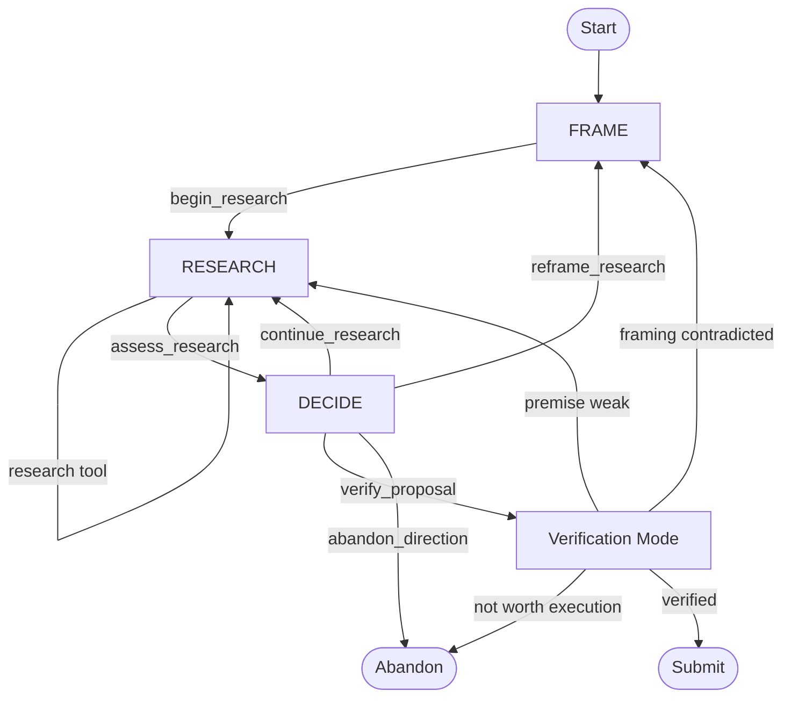

# SimpleLoop Proposer Scientist 元认知基与科研流程重构设计

> 状态：设计提案  
> 适用分支：`feature/proposer-agent-runtime`  
> 目标对象：单个 Proposer Scientist 的研究深度  
> 非目标：多 Proposer 候选生成、Generator Basis、外环自进化

---

## 1. 背景

当前 SimpleLoop 已经具备：

- `Proposer Scientist → Candidate Worker → Gate → Selection` 闭环；
- 跨轮持久化的三层研究历史：
  - Experiment Ledger；
  - Finding Archive；
  - Research Frontier；
- 每轮 fresh Proposer session；
- Proposer 主动检索历史实验与 Finding；
- 在实际代码优化任务中连续产生有效改进。

现阶段最主要的问题已经不再是“跨轮记忆是否存在”，而是：

> 单个 Proposer Scientist 在缺少人工 hint 时，容易快速形成第一个直觉，经过很少调查便提交 proposal；如果该方向失败，后续又容易围绕同一解释继续产生小变体，而不是重新判断证据是否充分、假设是否仍成立、是否需要改变研究问题。

当前 `Observe → Investigate → Checkpoint` 流程提供了阶段顺序，但没有充分保证：

- Scientist 在提出方向前明确真正的研究问题；
- Scientist 区分事实、历史结果、推断和猜测；
- 工具调用围绕决定相关的关键未知展开；
- 新 evidence 实际改变当前判断；
- Scientist 能根据不确定性自主选择快速提交、继续调查、重新 framing 或放弃。

因此，本设计聚焦于：

> 为单个 Proposer Scientist 建立一套适中的元认知基和自适应研究流程，使其能够在简单问题上快速行动，在证据薄弱、失败或冲突时主动加深调查。

---

## 2. 研究依据与设计立场

本设计综合以下研究方向：

- **Metacognitive Prompting**：将初步判断、批判评估和最终决定分开；
- **Self-Discover**：根据任务选择适合的推理模块，而不是对所有任务执行固定 Chain-of-Thought；
- **ReAct**：让推理、工具行动和外部观察交错，观察结果能够改变下一步行动；
- **Chain-of-Verification**：先形成暂定结论，再针对关键前提进行相对独立的验证；
- **Self-correction 研究**：没有外部证据或可靠 verifier 时，模型自由语言式自我批评并不稳定；
- **AI Scientist / DeepScientist 类系统**：通过 progressive validation、阶段管理和研究状态维护增加研究严谨性。

需要明确：

> 现有研究没有给出一套已经被证明最优、可以直接照搬的 Scientist 状态机。

因此，本文中的具体状态机是针对 SimpleLoop 的工程综合；其认知组件有研究依据，但组合方式仍需要通过对照实验验证。

---

## 3. 设计目标

### 3.1 核心目标

1. 减少无 hint 条件下第一轮草率 proposal。
2. 减少失败方向的连续小变体和自我合理化。
3. 让工具调用围绕关键未知，而不是泛化浏览源码。
4. 让新 evidence 能够改变 Scientist 的判断和下一步。
5. 允许简单、证据充分的问题走快速路径。
6. 允许证据薄弱、冲突或停滞的问题升级到深路径。
7. 让 Scientist 可以 `continue`、`reframe`、`submit` 或 `abandon`，而不是为了完成格式强制下注。
8. 保持当前单 Agent、单 session 的简洁性，不引入额外 Reviewer/Judger Agent。

### 3.2 非目标

第一版不解决：

- 单轮 candidate 全局多样性；
- 多 Proposer 调度；
- Generator Basis 的选择与演化；
- 生成元 Thompson sampling；
- 自动修改元认知基；
- 跨 run 科学知识库；
- Harness 对“科学推理正确性”的自动打分。

这些属于后续搜索宽度层和 self-improvement 层。

---

## 4. 设计原则

### 4.1 深度应由不确定性触发

Scientist 应具备深入调查的能力，但不应对所有问题执行完整深度流程。

```text
明确、低风险、有历史依据
    → 快路径

证据薄弱、结果冲突、方向失败、调查停滞
    → 深路径
```

### 4.2 元认知基不是每步必填 checklist

内部可使用 C1–C4、X1–X2 表示认知能力，但不应要求模型逐项输出：

```yaml
C1:
C2:
C3:
C4:
X1:
X2:
```

否则会退化为形式化填表。

### 4.3 外部证据优先于语言自信

不使用裸 `confidence=0.85` 作为 readiness 判断。

优先要求 Scientist 指明：

- 哪些是直接 evidence；
- 哪个关键未知尚未解决；
- 该未知是否可能改变实验决策。

### 4.4 认识更新比步骤数量更重要

研究深度不由以下指标定义：

- 工具调用次数；
- reasoning 长度；
- 是否已经走完三个 phase；
- 是否输出了完整 JSON。

而由以下结果定义：

> 一个研究 step 是否改变了 Scientist 对问题、证据或下一步行动的认识。

### 4.5 不把临时解释写成长时事实

本轮 hypotheses、inference、critical unknown 等只属于 round-local working state。

它们：

- 不进入 Experiment Ledger；
- 不获得 Finding Archive 的事实权；
- 不自动跨轮继承；
- 不替代 Gate、metrics 和实际实验结果。

---

## 5. 元认知基：4 个常驻核心 + 2 个条件强化

完整的 11 项元认知能力适合作为能力目录，但对于当前代码优化任务过于庞大。

第一版采用：

```text
常驻核心：C1–C4
条件强化：X1–X2
```

---

## 6. 常驻核心元认知元

### C1. Research Target

**目的：**明确当前要作出的研究判断及其关键未知。

Scientist 应能够回答：

- 当前真正要判断的是什么？
- 什么事实会改变是否值得提出 proposal？
- 当前最重要的未知是什么？

错误 framing：

```text
寻找 QPDF 优化。
```

更好的 framing：

```text
判断 accepted source 中 QPDF lookup 是否仍有足够成本，
值得占用一次 Candidate Worker。
```

C1 合并了：

- Epistemic Aim；
- Evidence Gap；
- 轻量 Strategy Selection。

---

### C2. Evidence Discipline

**目的：**防止把“代码看起来可优化”直接当作“它会改善 objective”。

Scientist 应区分：

```text
Observation
    代码中可直接观察到的结构。

Historical Result
    Experiment Ledger 中的实际 Gate、metric 或 diff 结果。

Inference
    根据 evidence 得出的合理解释。

Speculation
    尚未验证的收益估计或机制猜测。
```

示例：

```text
Observation:
    某 lookup 位于 trial-vertex 内循环。

Historical Result:
    过去一次相邻路径的 invariant hoisting 改善了 8%。

Inference:
    当前 lookup 可能仍存在重复工作。

Speculation:
    将其提升到外层预计可改善 5%–10%。
```

C2 不要求所有问题都列出多个竞争假设；只有在 evidence 可以由多种机制解释时，才展开替代解释。

C2 合并了：

- Hypothesis-Space Awareness；
- Epistemic Status Separation；
- Evidence Sufficiency 的基础部分。

---

### C3. Evidence-Guided Inquiry

**目的：**使每次调查服务于一个决定相关的关键未知。

核心循环：

```text
information need
    → tool action
    → observation
    → implication
    → next action
```

每次重要工具调用前，Scientist 应知道：

- 我要解决哪个关键未知？
- 什么结果可能改变当前判断？

每次重要 observation 后，Scientist 应判断：

- 它加强、削弱还是不影响当前方向？
- 它消除了哪个未知？
- 下一步是否需要改变？

示例：

```yaml
information_goal: >
  确认该访问是否处于最内层高频路径。

observation: >
  调用发生在每个 trial vertex 的 k-loop 内。

implication: >
  支持存在高频重复工作的判断；
  下一步应检查历史是否已有同类 hoist，而不是立即提交。
```

C3 合并了：

- Discriminating Inquiry；
- Belief Updating；
- Progress Monitoring 的局部部分。

---

### C4. Research Decision

**目的：**自主判断当前研究应如何推进。

Scientist 在控制点选择：

```text
continue_research
reframe_research
submit_proposal
abandon_direction
```

判断标准不是：

```text
我是否已经写得出 proposal？
```

而是：

```text
当前 evidence 是否足以认为这个实验值得消耗一次 Candidate Worker？
```

C4 合并了：

- Evidence Sufficiency；
- Progress Monitoring；
- Rational Stopping；
- Abstention。

---

## 7. 条件强化元认知元

### X1. Challenge / Reframe

**目的：**在高风险情形下挑战当前解释，防止确认偏误和无效死磕。

触发条件：

- 新 Finding 且没有直接 evidence；
- 当前方向已有 neutral / regression；
- 同一 Finding 连续多次没有改善；
- 历史存在相反实验结果；
- 调查多次但关键未知没有减少；
- proposal 与历史方案高度相似；
- 当前解释主要依赖 speculation。

触发后，Scientist 应问：

- 当前解释可能错在哪里？
- 是否存在更简单或更有影响的替代解释？
- 是否存在“该区域不是主要瓶颈”的零假设？
- 什么 evidence 能区分这些解释？
- 当前应当换工具、换假设，还是重新 framing？

X1 合并了：

- Disconfirmation Control；
- Competing Hypotheses；
- Strategy Reassessment。

---

### X2. Proposal Verification

**目的：**在提交前验证 proposal 最脆弱的前提。

仅在已经形成 draft proposal 时激活。

核查内容：

1. 目标机制是否有直接 evidence？
2. 机制与 objective 的联系是否只是直觉？
3. proposal 是否真正干预该机制？
4. 历史是否存在近重复或相反结果？
5. 剩余未知是否会让实验明显不值得执行？
6. proposal 是否保持单轮可实施范围？

验证必须指向：

- accepted source；
- Experiment Ledger；
- Finding refs；
- metrics；
- changed paths；
- read-only research tools。

不依赖模型自由语言式“再想一遍”。

验证结果：

```text
verified
    → submit

weak premise
    → continue_research

historical contradiction
    → reframe_research

not worth execution
    → abandon_direction
```

---

## 8. 自适应研究深度

### 8.1 快路径

适用于：

- 机制直接可见；
- 有历史支持；
- scope 明确；
- 没有近重复；
- 风险低；
- 剩余未知只影响收益大小，不影响实验是否值得做。

流程：

```text
FRAME
  → RESEARCH
  → DECIDE
  → VERIFY
  → SUBMIT
```

快路径不强制：

- 多个竞争假设；
- 反证搜索；
- 多轮 reframe；
- 固定数量的工具调用。

---

### 8.2 深路径

触发条件：

- 第一轮且没有 hint；
- 缺少决定相关 evidence；
- 当前方向已经失败；
- 多种机制都能解释现象；
- 历史中存在冲突结果；
- 连续调查没有推进；
- proposal 与历史近重复。

流程：

```text
FRAME
  → RESEARCH
  → CHALLENGE
  → RESEARCH
  → REFRAME
  → RESEARCH
  → DECIDE
  → VERIFY
```

深路径不是固定流程；它表示 Scientist 获得更多循环和 reframe 自主权。

---

## 9. 科研流程重构

当前：

```text
Observe → Investigate → Checkpoint
```

建议重构为：

```text
FRAME → RESEARCH ↔ DECIDE
```

其中：

- evidence update 不是独立 phase；
- Challenge 是条件模式；
- Verification 是提交前子流程。

---

## 10. 状态语义

### 10.1 FRAME

替代当前 `Observe`。

职责：

- 确定研究问题；
- 确定决定相关未知；
- 建立轻量 evidence 边界；
- 选择初始调查方式；
- 需要时维护替代解释。

激活：

```text
C1 Research Target
C2 Evidence Discipline
条件性 X1 Challenge / Reframe
```

FRAME 不应直接要求 proposal。

推荐输出：

```yaml
research_question:
decision_relevant_unknown:
known_evidence:
working_inference:
next_information_goal:
```

可选：

```yaml
alternative_explanations:
```

只有在 evidence 薄弱或存在明显歧义时才使用。

---

### 10.2 RESEARCH

替代当前 `Investigate`。

职责：

- 围绕关键未知调用源码、历史和实验检索工具；
- 将 observation 转化为 implication；
- 更新下一项调查目标；
- 识别调查是否停滞。

激活：

```text
C2 Evidence Discipline
C3 Evidence-Guided Inquiry
条件性 X1 Challenge / Reframe
```

每次工具调用前，模型应在内部明确：

```text
information_goal
expected_decision_impact
```

每次重要结果后，更新：

```text
observation
implication
remaining_unknown
next_information_goal
```

不要求所有字段在每个 tool call 中完整显式输出。

---

### 10.3 DECIDE

替代当前 `Checkpoint`。

职责：

- 判断当前研究是否仍有认识增量；
- 决定继续、重构、提交或放弃；
- 需要提交时进入 verification 子流程。

激活：

```text
C4 Research Decision
条件性 X1 Challenge / Reframe
条件性 X2 Proposal Verification
```

DECIDE 不是“流程的第三站”，而是控制中心。

允许动作：

```text
continue_research
reframe_research
verify_proposal
submit_proposals
abandon_direction
```

---

## 11. 状态机



---

## 12. Runtime Action 设计

### 12.1 `frame_research`

用途：

- 从目标、Frontier 和当前 source 状态形成研究问题；
- 建立关键未知；
- 设置下一项信息目标。

输入语义：

```text
Do not search for a proposal yet.
Define what must be understood before an experiment is worth proposing.
```

返回：

```yaml
action: frame_research
research_question:
decision_relevant_unknown:
known_evidence:
working_inference:
next_information_goal:
```

---

### 12.2 Research Tools

保留现有：

- `inspect_finding`
- `inspect_episode`
- `search_findings`
- `search_experiments`
- `run_research_command`

工具本身不负责元认知判断。

阶段 Prompt 要求 Scientist：

- 调用工具前明确该调用解决哪个未知；
- 得到结果后判断它改变了什么；
- 无认识增量时改变调查方式。

---

### 12.3 `assess_research`

从 RESEARCH 进入 DECIDE。

返回紧凑状态：

```yaml
action: assess_research
current_judgment:
supporting_evidence:
blocking_unknown:
research_progress: advancing | stalled | contradicted
draft_proposal:
```

`draft_proposal` 可为空。

---

### 12.4 `continue_research`

适用：

- 仍存在一个可能改变决策的关键未知；
- 下一项调查具有明确的信息目标；
- 当前研究仍在推进。

返回：

```yaml
action: continue_research
next_information_goal:
why_it_matters:
```

---

### 12.5 `reframe_research`

适用：

- 当前解释被 evidence 削弱；
- 调查停滞；
- 历史显示该机制反复失败；
- 研究问题本身过宽或错误。

返回：

```yaml
action: reframe_research
what_failed:
new_research_question:
new_decision_relevant_unknown:
```

---

### 12.6 `verify_proposal`

适用：

- 已形成具体、单轮可实施的 draft proposal；
- evidence 已基本足够；
- 需要核查其最脆弱前提。

返回：

```yaml
action: verify_proposal
draft_proposal:
weakest_premise:
verification_question:
verification_source:
```

Verification 可以继续调用 read-only tools。

---

### 12.7 `submit_proposals`

仅在 verification 通过后使用。

第一版建议仍支持原有 candidate 数量，但长期应改为：

```text
0..N proposals
```

而不是强制恰好 N 个。

建议 proposal 增加紧凑 evidence 字段：

```yaml
instruction:
research_target:
evidence_refs:
mechanism:
material_difference:
```

不要求完整 Chain-of-Thought。

---

### 12.8 `abandon_direction`

适用：

- 当前没有值得消耗 Worker 的 proposal；
- 继续调查的预期价值很低；
- 当前方向已被 evidence 显著削弱；
- 研究预算耗尽但仍缺少决定性 evidence。

返回：

```yaml
action: abandon_direction
reason:
remaining_unknown:
```

注意：

- abandon 不等于整个 round 必须失败；
- 未来多 Proposer 架构中，一个 Scientist 可以零产出；
- 当前单 Proposer 阶段可以由 Harness 决定是否重新启动一个 fresh Scientist 或结束本轮。

---

## 13. Round-local Epistemic State

建议扩展当前 `WorkingState`：

```yaml
phase: frame | research | decide

research_question:
decision_relevant_unknown:

known_evidence:
  - ref:
    kind: observation | historical_result | measurement
    implication:

working_inference:
alternative_explanations:

current_information_goal:
blocking_unknown:

research_progress:
  state: advancing | stalled | contradicted
  last_meaningful_update_step:

draft_proposal:
verification:
  status: not_started | needed | passed | failed
  weakest_premise:
```

约束：

- 仅在本次 Runtime 中存在；
- 不写入 Finding Archive；
- 不被下一轮 Proposer 直接继承；
- Runtime 结束后可作为 telemetry 保存，但不作为事实输入；
- Harness 不需要判断其科学正确性，只负责 schema 和状态转换。

---

## 14. Prompt 分层

### 14.1 Global Scientist Deliberation Policy

放在 system prompt，保持短而稳定。

建议语义：

```text
You are responsible for forming an experiment worth running, not merely for
writing a plausible proposal.

Establish the decision-relevant research question before proposing a change.
Separate observed evidence and historical results from inference and
speculation.

Investigate the most important missing fact rather than collecting broadly
related information. After meaningful evidence, reconsider what it changes
about the direction and what should be done next.

Use as much investigation as the uncertainty warrants. Straightforward,
well-supported opportunities may proceed quickly. Weak, conflicting, stalled,
or repeatedly unsuccessful directions require challenge or reframing.

Submit only when the evidence makes a concrete experiment worth its execution
cost. Otherwise continue research, reframe the question, or abandon the
direction.
```

---

### 14.2 Phase-specific Prompt

#### FRAME

强调：

- 当前不要急于提出 proposal；
- 确定研究决策和关键未知；
- 简单问题保持简洁；
- 证据薄弱时保留替代解释。

#### RESEARCH

强调：

- 每次工具调用服务于一个关键未知；
- 观察结果必须改变判断、未知或下一步；
- 无认识增量时换策略或进入 DECIDE。

#### DECIDE

强调：

- Checkpoint 不代表研究完成；
- 判断剩余未知是否会改变实验价值；
- 选择 continue、reframe、verify 或 abandon。

#### VERIFY

强调：

- 不润色 proposal；
- 检查其最脆弱前提；
- 回到原始 source、Ledger 或 metrics；
- 验证失败时允许继续调查或放弃。

---

## 15. 与 Memory 系统的边界

### Memory 提供

- 不可变 Experiment Ledger；
- Finding 问题容器；
- Research Frontier；
- 历史检索工具；
- accepted source 的可追踪事实。

### Deliberation Runtime 提供

- 本轮研究问题；
- 当前 inference；
- 关键未知；
- evidence implication；
- 是否继续、reframe、submit 或 abandon。

### 不应发生

- 将本轮 inference 写入 Finding 作为长期结论；
- 让 LLM 改写历史实验事实；
- 将 readiness 变成跨轮权威标签；
- 用语言总结覆盖 Ledger。

---

## 16. 与 Generator Basis 的边界

Generator Basis 是后续研究宽度层。

其作用：

```text
从成本、分解、异常、算法替换等不同方法论视角进入问题。
```

Deliberation Policy 的作用：

```text
进入某个视角后，判断真正的问题是什么、
证据是否充分、是否应继续调查和是否值得提交实验。
```

完整关系：

```text
Generator Lens
    → FRAME
    → RESEARCH
    → DECIDE
    → Candidate Worker
```

实施顺序：

```text
1. 单个 Scientist 的研究深度
2. 无 hint 条件下 proposal 有效率
3. Memory 跨轮连续性
4. Generator Basis 扩展宽度
5. 多 Scientist Candidate Harness
```

---

## 17. 与 Candidate Worker / Executor 的边界

Proposer Scientist 负责：

- 研究“什么值得尝试”；
- 提供 evidence-grounded proposal；
- 不负责完整实现规划；
- 不运行正式 Gate；
- 不决定实验结果是否成功。

Candidate Worker / Executor 负责：

- 实现 proposal；
- 调查实现细节；
- 运行 compile、gate、eval；
- 返回确定性结果。

Deliberation Runtime 不应演化为一个提前实现 proposal 的隐藏 Executor。

---

## 18. MVP 实施范围

### Phase A：Prompt-only Prototype

修改：

- Global Scientist Deliberation Policy；
- `Observe` 语义改为 `Frame`；
- `Investigate` 语义改为 evidence-guided Research；
- `Checkpoint` 语义改为 Decide；
- 增加 `abandon_direction`；
- 增加 submit 前 verification 要求。

暂不修改：

- 长期 Memory；
- Finding schema；
- Experiment Ledger；
- 多 Proposer；
- Generator Basis。

目标：

> 验证仅通过角色原则和 phase prompt，能否降低草率 proposal 与失败死磕。

---

### Phase B：Round-local Epistemic State

扩展 `WorkingState`：

- research question；
- critical unknown；
- evidence；
- current inference；
- research progress；
- draft proposal；
- verification state。

目标：

> 防止不同 action 之间遗忘前面识别出的关键未知和证据边界。

---

### Phase C：状态机与 Action 重构

实现：

- `FRAME / RESEARCH / DECIDE`；
- `assess_research`；
- `continue_research`；
- `reframe_research`；
- `verify_proposal`；
- `abandon_direction`；
- 非线性循环；
- verification 子模式。

目标：

> 让状态转换对应认识变化，而不是流程进度。

---

### Phase D：自适应深度

根据当前研究信号动态强化 X1：

- new Finding；
- neutral/regression；
- historical contradiction；
- stalled research；
- historical near-duplicate。

目标：

> 简单任务保持快路径，困难任务自动进入深路径。

---

## 19. 对照实验设计

在相同：

- accepted SHA；
- model；
- Memory snapshot；
- candidate budget；
- max steps；
-任务目标；

条件下比较：

### A. 当前基线

```text
Observe → Investigate → Checkpoint
```

### B. Global Policy Only

只增加 Scientist Deliberation Policy。

### C. Policy + 新 Phase 语义

```text
FRAME → RESEARCH → DECIDE
```

### D. Policy + 新流程 + Epistemic State

完整 MVP。

---

## 20. 评估指标

### 20.1 Proposal 质量

- proposal admission rate；
- Executor completion rate；
- Gate pass rate；
- objective improvement rate；
- selected rate；
- cost per eligible candidate；
- cost per improvement。

### 20.2 研究深度行为

- 第一轮无 hint 条件下无效 proposal 比例；
- proposal 前有效 evidence refs 数量；
- 工具结果导致方向改变的比例；
- neutral/regression 后 reframe 率；
- 同一 Finding 连续近重复 proposal 比例；
- historical contradiction 被发现的比例；
- abandon 后避免的低价值 Worker 数量。

### 20.3 研究效率

- Proposer token；
- elapsed time；
- tool calls；
- 无认识增量工具调用比例；
- 平均研究 step；
- 快路径占比；
- 深路径占比。

### 20.4 防止“科研过度”

重点观察：

- 简单、高证据方向的平均 steps 是否显著增加；
- proposal 有效率是否提高但 token 成本失控；
- 是否出现机械替代假设；
- 是否出现无意义 verification；
- 是否出现过度 abandon。

---

## 21. 初步验收标准

第一版不要求所有指标同时显著改善，但至少应达到：

1. 无 hint 第一轮草率 proposal 比例下降；
2. neutral/regression 后 reframe 行为增加；
3. historical near-duplicate 比例下降；
4. Gate pass 或 improvement rate 不下降；
5. 简单方向的平均 token 成本不出现数量级增长；
6. Scientist 能实际使用 continue / reframe / abandon，而不是始终 submit；
7. 输出不退化为 C1–C4 的机械表演。

---

## 22. 风险与缓解

### 22.1 元认知表演

风险：

```text
模型学会写“证据不足”“已考虑替代解释”，
但行为仍然不变。
```

缓解：

- 关注 tool choice 和 direction change；
- evidence 必须引用 source / Ledger；
- 不以 reasoning 文本长度评分；
- 不要求显式输出所有认知元。

---

### 22.2 过度调查

风险：

- 简单优化被研究过度；
- token 和时间成本上升；
- Scientist 不愿提交。

缓解：

- 明确支持快路径；
- X1 仅条件触发；
- 剩余未知只影响收益大小时允许提交；
- 设置 max steps 和 rational stopping。

---

### 22.3 过度弃权

风险：

- Scientist 把不确定性当成逃避；
- candidate 产量不足。

缓解：

- abandon 要说明决定相关 blocking unknown；
- 统计 abandon 后人工回看；
- 当前单 Proposer 阶段可由 Harness 重启 fresh Runtime；
- 多 Proposer 阶段允许某些 Scientist 零产出。

---

### 22.4 自我验证失效

风险：

- 模型只是重新合理化 draft proposal。

缓解：

- verification 指向最脆弱前提；
- 回到原始 source、Ledger 和 metrics；
- 不让 verification 只做语言润色；
- 后续仍有问题时再考虑 fresh critic，而不是第一版加入。

---

### 22.5 WorkingState 污染长期记忆

风险：

- 暂时 inference 被后续 Scientist 当成事实。

缓解：

- round-local state 与 Memory 完全分离；
- 长期只保存实验事实和 Finding refs；
- telemetry 不注入下一轮 startup pack。

---

## 23. 回滚策略

每个实施阶段独立开关：

```yaml
deliberation_policy_enabled: true
epistemic_state_enabled: false
adaptive_depth_enabled: false
verification_enabled: false
abstain_enabled: false
```

支持逐项 A/B。

如果出现：

- token 成本显著失控；
- proposal admission / Gate pass 明显下降；
- 大量机械元认知文本；
- abandon 比例异常；
- 简单任务严重变慢；

可以回滚到上一阶段，而不影响：

- Experiment Ledger；
- Finding Archive；
- Research Frontier；
- Candidate Worker；
- Gate；
- Selection。

---

## 24. 最终架构

```text
Scientific Memory
    Experiment Ledger
    Finding Archive
    Research Frontier

        ↓ factual context

Proposer Scientist Runtime
    Global Deliberation Policy

    FRAME
        C1 Research Target
        C2 Evidence Discipline

    RESEARCH
        C3 Evidence-Guided Inquiry
        conditional X1 Challenge / Reframe

    DECIDE
        C4 Research Decision
        conditional X2 Proposal Verification

        ↓

    continue / reframe / submit / abandon

        ↓ submitted proposal

Candidate Worker
    implementation
    gates
    metrics
    result collection

        ↓

Scientific Memory
```

---

## 25. 结论

当前 SimpleLoop 不需要完整启用 11 个元认知元，也不应只依赖一句“think deeply”。

推荐方案是：

```text
4 个常驻核心
    C1 Research Target
    C2 Evidence Discipline
    C3 Evidence-Guided Inquiry
    C4 Research Decision

2 个条件强化
    X1 Challenge / Reframe
    X2 Proposal Verification
```

科研流程重构为：

```text
FRAME → RESEARCH ↔ DECIDE
```

并支持：

```text
continue
reframe
submit
abandon
```

其核心语义是：

> Scientist 不需要永远思考得更多，而需要知道什么时候证据已经足够，什么时候必须继续调查，什么时候当前解释应该被挑战，以及什么时候一个 proposal 还不值得占用 Candidate Worker。

这一步应先于 Generator Basis 和多 Proposer Candidate Harness，因为只有先证明单个 Scientist 能在无 hint 条件下产生足够有效的研究判断，扩展研究宽度才有意义。
