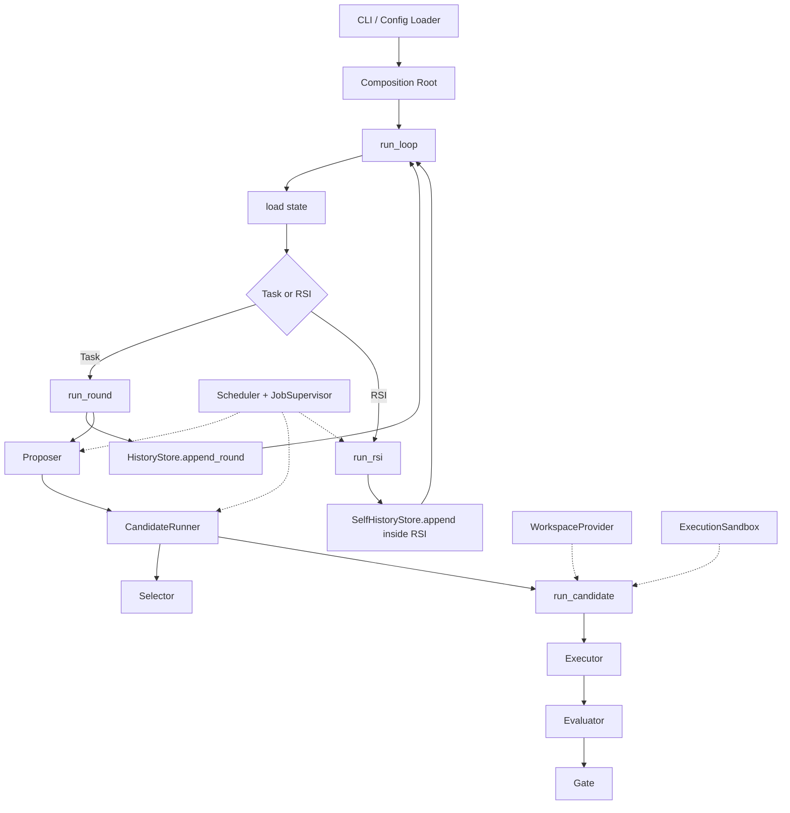

# SimpleLoop Typed Pipeline 重构设计

**状态：** 已确认，待实施计划
**日期：** 2026-08-14
**范围：** SimpleLoop Host/Kernel；不重写独立 `proposer/` 的科研逻辑

## 1. 背景

当前 SimpleLoop 已完成 proposer 独立进程化与 RSI 闭环，但 Host 同时承担轮次编排、Git workspace、Apptainer、Local/HEPJob 调度、worker 协议、恢复、评估、gate、selection、history、reporting 和 RSI 生命周期。功能是正确方向，结构仍有以下问题：

- `loop.py` 同时包含编排与 Local candidate 业务实现。
- 模块通过 `RunContext` 和原始 `dict` 隐式共享依赖。
- Local backend 反向 import `loop.py`，依赖方向不稳定。
- Host 仍直接 import proposer 内部类型。
- Workspace、Sandbox、Scheduler 和业务阶段互相知道实现细节。
- HEPJob 对 baseline、candidate、proposer 重复实现监督、重试、collect 和恢复。
- worker 具有多种 manifest/result 形状和完成标记。
- RSI 在单个 Host 模块中重复 Git、subprocess、worker 和持久化机制。

本次重构保留现有核心能力，目标是把 SimpleLoop 变成一条一眼可读、输入输出明确、模块职责单一的 typed pipeline。

## 2. 目标

### 2.1 总目标

> Loop 只表达顺序和分支；每个模块具有明确 Request、Result、副作用和持久化所有权；具体 Workspace、Sandbox、Scheduler 和 Proposer 实现可以替换。

### 2.2 必须保留的能力

- Local 与 HPC/HEPJob 执行。
- Agent 联网。
- 文件系统隔离与显式 RO/RW 世界。
- baseline evaluation。
- 并行 candidates。
- executor、evaluation、hard gate 和 objective selection。
- crash resume 与基础设施重试。
- 权威 task history。
- proposer 独立进程边界。
- 完整 RSI：review、edit、viability、adopt/reject 和连续性。
- telemetry、plot 和 export。

### 2.3 非目标

- 不改变 proposer 的科研方法、prompt 或 memory 语义。
- 不强制弃用 Apptainer；它变成可替换的 HPC provider。
- 不引入 Prefect、Dagster、IOC 容器、通用事件总线或完整插件框架。
- 不把所有内部函数发布成稳定第三方 API。
- 不同时改变优化语义与架构。
- 不以减少文件或行数本身作为成功标准。
- 本阶段不实现模型凭证代理；注入到 Agent 进程的凭证可被其子进程读取，这是明确接受的边界。

## 3. 设计原则

1. **显式端口：** 每个动作遵循 `Output operation(Input request)`。
2. **不可变数据：** Request/Result 使用 frozen dataclass；不在阶段间传递可变大字典。
3. **无万能 Context：** 禁止把整个 `RunContext`、Application 或原始配置传给业务模块。
4. **机制与语义分离：** Scheduler 只调度；Sandbox 只隔离执行；Workspace 只管理源码状态。
5. **业务失败是结果：** abstain、timeout、no-change、eval failure、gate reject、RSI KEEP/拒绝均是正常结果。
6. **基础设施失败才重试：** 节点丢失、worker 无结果、OOM、调度失败由通用 supervisor 处理。
7. **单一 writer：** 每种持久化数据有且只有一个 owner。
8. **渐进迁移：** 每一步新增明确接口、迁移一个责任并删除对应旧责任。
9. **最少抽象：** 只为真实可替换实现和资源生命周期定义 Protocol/Handle。

## 4. 总体架构



系统包含三条嵌套业务 pipeline：

- `run_loop`：状态推进、Task/RSI 选择、持久化和终止。
- `run_round`：propose、candidate batch、selection。
- `run_candidate`：workspace、world、execute、commit、evaluate、gate。

RSI 是与 Task Round 平行的 pipeline，不穿插 candidate 业务内部。

## 5. 顶层 Pipeline

### 5.1 Loop

```python
def run_loop(
    request: LoopRequest,
    *,
    history: HistoryStore,
    run_round: RoundRunner,
    run_rsi: RsiRunner,
) -> LoopResult:
    ...
```

`run_loop` 只负责：

```text
load state
→ decide Task / RSI
→ invoke pipeline
→ persist terminal result
→ advance incumbent / commitment
→ next / stop
```

### 5.2 Round

```python
def run_round(
    request: RoundRequest,
    *,
    proposer: Proposer,
    candidates: CandidateRunner,
    selector: Selector,
) -> RoundResult:
    ...
```

```text
RoundRequest
→ ProposalBatch
→ CandidateBatch
→ Selection
→ RoundResult
```

### 5.3 Candidate

```python
def run_candidate(
    request: CandidateRequest,
    *,
    world_builder: WorldBuilder,
    executor: Executor,
    evaluator: Evaluator,
    gate: Gate,
) -> CandidateResult:
    ...
```

```text
open SourceWorkspace
→ build World
→ execute
→ inspect + commit changes
→ evaluate
→ apply gates
→ return CandidateResult
→ cleanup World/Workspace
```

Executor、Evaluator、Gate 是独立模块，但 Candidate Pipeline 可在同一个 HEPJob worker 内连续执行，避免把一个 candidate 拆成多个 Condor jobs。

## 6. 核心领域数据

```python
@dataclass(frozen=True)
class LoopRequest:
    spec: LoopSpec
    run_dir: Path
    resume: bool = False
    target_rounds: int | None = None

@dataclass(frozen=True)
class RoundRequest:
    round_id: int
    goal: str
    incumbent_sha: str
    incumbent_metrics: Metrics

@dataclass(frozen=True)
class Proposal:
    instruction: str
    evidence_refs: tuple[str, ...] = ()

@dataclass(frozen=True)
class ProposalBatch:
    proposals: tuple[Proposal, ...]
    abstention: Abstention | None = None
    telemetry: Telemetry = field(default_factory=Telemetry)

@dataclass(frozen=True)
class CandidateArtifact:
    parent_sha: str
    sha: str
    changed_paths: tuple[PurePosixPath, ...]

@dataclass(frozen=True)
class CandidateResult:
    candidate_id: int
    proposal: Proposal
    status: CandidateStatus
    execution: ExecutionResult
    artifact: CandidateArtifact | None
    evaluation: EvaluationResult | None
    gate: GateDecision

@dataclass(frozen=True)
class RoundResult:
    round_id: int
    parent_sha: str
    proposals: ProposalBatch
    candidates: tuple[CandidateResult, ...]
    selection: Selection
```

`CandidateResult` 是 worker result、history candidate 和 export 的唯一领域来源。持久化格式由唯一 codec 产生。

## 7. SourceWorkspace、ExecutionSandbox 与 World

### 7.1 语义边界

| 概念 | 责任 |
|---|---|
| `SourceWorkspace` | Git revision、worktree、diff、commit、cleanup |
| `ExecutionSandbox` | mounts、环境、网络、进程、timeout、隔离 |
| `World` | 将一个 SourceWorkspace 按 Sandbox policy 提供给业务阶段 |

Workspace 不执行程序；Sandbox 不理解 Git；World 是业务使用的高层 facade。

### 7.2 Workspace

```python
@dataclass(frozen=True)
class WorkspaceSpec:
    workspace_id: str
    revision: str

@dataclass(frozen=True)
class SourceWorkspace:
    workspace_id: str
    path: Path
    base_sha: str

class WorkspaceProvider(Protocol):
    @contextmanager
    def open(self, spec: WorkspaceSpec) -> Iterator[SourceWorkspace]:
        ...
```

Git 实现使用 detached worktree。操作以普通函数表达：

```python
def inspect_changes(workspace: SourceWorkspace) -> ChangeSet: ...
def commit_changes(workspace: SourceWorkspace, request: CommitRequest) -> CandidateArtifact: ...
def diff_artifact(artifact: CandidateArtifact) -> str: ...
```

### 7.3 Sandbox

```python
@dataclass(frozen=True)
class SandboxSpec:
    image: Path
    network: bool = True
    mounts: tuple[MountSpec, ...] = ()
    environment: Mapping[str, str] = field(default_factory=dict)
    timeout_seconds: int = 3600

@dataclass(frozen=True)
class ProcessRequest:
    argv: tuple[str, ...]
    cwd: PurePosixPath
    environment: Mapping[str, str] = field(default_factory=dict)
    stdin: str | None = None

@dataclass(frozen=True)
class ProcessResult:
    argv: tuple[str, ...]
    exit_code: int
    stdout: str
    stderr: str
    duration_seconds: float
    timed_out: bool = False

class ExecutionSandbox(Protocol):
    def run(self, request: ProcessRequest) -> ProcessResult:
        ...
```

首个实现为 `ApptainerSandbox`；后续可增加 Podman 或 Remote adapter。业务层不出现 Apptainer 参数。

### 7.4 Mount 和安全边界

```python
@dataclass(frozen=True)
class MountSpec:
    source: Path
    target: PurePosixPath
    mode: MountMode = MountMode.READ_ONLY
```

- mount 默认只读。
- source 只能来自当前 workspace、允许暴露的 run artifacts、配置声明的 external RO roots 或专用临时目录。
- Agent 可联网，但只看到显式挂载的文件和显式环境变量。
- 系统不保证阻止 Agent 外传已经挂载或注入的数据。
- 不以抵御内核逃逸或恶意多租户为目标。

### 7.5 World

```python
@dataclass(frozen=True)
class WorldSpec:
    workspace: WorkspaceSpec
    sandbox: SandboxSpec
    writable_paths: tuple[PurePosixPath, ...]
    external_readonly: tuple[Path, ...] = ()

@dataclass(frozen=True)
class World:
    workspace: SourceWorkspace
    sandbox: ExecutionSandbox

    def run(self, request: ProcessRequest) -> ProcessResult:
        return self.sandbox.run(request)

class WorldBuilder(Protocol):
    @contextmanager
    def open(self, spec: WorldSpec) -> Iterator[World]:
        ...
```

同一 workspace 可被 Executor 和 Evaluator 的独立 sandbox runs 连续使用。

## 8. 业务阶段接口

### 8.1 Proposer

```python
@dataclass(frozen=True)
class ProposerRequest:
    goal: str
    round_id: int
    incumbent_sha: str
    world: WorldSpec
    history: HistoryViewSpec
    proposal_limit: int

class Proposer(Protocol):
    def propose(self, request: ProposerRequest) -> ProposalBatch:
        ...
```

Host 不 import proposer 的 model、scientist 或 memory 类型。`research_target`、`finding_id` 等 Host 不消费的字段不进入核心契约。

### 8.2 Executor

```python
@dataclass(frozen=True)
class ExecutionRequest:
    goal: str
    proposal: Proposal
    world: World

class Executor(Protocol):
    def execute(self, request: ExecutionRequest) -> ExecutionResult:
        ...
```

Executor 不创建 worktree、不 commit、不 eval、不 gate、不选择 winner、不写 history。

### 8.3 Evaluator

```python
@dataclass(frozen=True)
class EvaluationRequest:
    world: World
    commands: tuple[tuple[str, ...], ...]
    metrics: MetricsSpec

class Evaluator(Protocol):
    def evaluate(self, request: EvaluationRequest) -> EvaluationResult:
        ...
```

### 8.4 Gate 与 Selector

二者是纯函数：

```python
def apply_gates(evaluation: EvaluationResult, spec: GateSpec) -> GateDecision: ...

def select_candidate(
    candidates: tuple[CandidateResult, ...],
    incumbent_metrics: Metrics,
    objective: ObjectiveSpec,
    policy: SelectionPolicy,
) -> Selection:
    ...
```

Gate 只判断 eval/hard gates；Selector 只判断 eligibility 与 objective improvement。Static proposal 的特殊推进规则通过显式 `SelectionPolicy` 表达。

## 9. 错误契约

### 9.1 正常业务结果

以下进入 typed Result，不抛异常：

- proposer abstention。
- executor failure/timeout。
- no changes。
- eval command failure/invalid metrics/timeout。
- gate rejection。
- no improving candidate。
- RSI KEEP、no-change、non-viable、reject。

### 9.2 基础设施错误

```python
class InfrastructureError(RuntimeError):
    retryable: bool
```

包括节点丢失、scheduler failure、worker 未产生结果、OOM、临时文件系统失败。由 JobSupervisor 根据 RetryPolicy 处理。

### 9.3 协议错误

```python
class ProtocolError(RuntimeError):
    ...
```

包括 manifest/result 无法解析、必要字段缺失、request id/kind 不一致。协议错误不重试并中止当前 run。

### 9.4 配置错误

`ConfigError` 只允许在 Config Loader/Composition Root 阶段出现；领域模块不读取 YAML 或解释环境变量。

## 10. Scheduler、Supervisor 与 Worker

### 10.1 Scheduler 原语

```python
@dataclass(frozen=True)
class JobSpec:
    job_id: str
    manifest_path: Path
    result_path: Path
    argv: tuple[str, ...]
    resources: ResourceSpec
    retry: RetryPolicy

class Scheduler(Protocol):
    def submit(self, job: JobSpec) -> JobHandle: ...
    def inspect(self, jobs: tuple[JobHandle, ...]) -> tuple[JobState, ...]: ...
    def cancel(self, job: JobHandle) -> None: ...
```

`LocalScheduler` 与 `HEPJobScheduler` 只实现位置相关原语。

### 10.2 通用 JobSupervisor

```python
class JobSupervisor:
    def run_batch(
        self,
        request: JobBatchRequest,
        *,
        scheduler: Scheduler,
        journal: JobJournal,
    ) -> JobBatchResult:
        ...
```

唯一的 supervisor 负责 manifest、submit、poll、timeout、retry、resume、result validation 和 collect。HEPJob provider 只保留 submit/query/remove/resource encoding。

### 10.3 统一 Worker

```bash
python -m simpleloop.scheduling.worker --manifest manifest.json
```

Manifest 与 result 使用同一 envelope：

```json
{
  "protocol": "simpleloop.worker.v1",
  "kind": "candidate",
  "request_id": "r3-c1",
  "payload": {},
  "result_path": ".../result.json"
}
```

```json
{
  "protocol": "simpleloop.worker.v1",
  "kind": "candidate",
  "request_id": "r3-c1",
  "status": "completed",
  "result": {},
  "usage": [],
  "error": null
}
```

`kind` 为 `proposer`、`candidate`、`self_review` 或 `viability`。Worker 延迟加载对应 handler；RSI self-repo redirect 在 proposer handler 内完成。

Worker 使用 `tmp + fsync + os.replace` 原子写一个 `result.json`。存在合法 result 即 business terminal；scheduler terminal 但无合法 result 即 infrastructure failure。旧 `_FINISHED`、独立 usage/meta 文件不进入新协议。

## 11. Crash Resume 与持久化

### 11.1 单一 Inflight Journal

每个 run 同时只允许一个 active stage：

```json
{
  "schema": "simpleloop.inflight.v1",
  "round_id": 3,
  "stage": "candidates",
  "parent_sha": "...",
  "request": {},
  "jobs": [
    {
      "job_id": "r3-c0",
      "scheduler_handle": {},
      "attempt": 1,
      "state": "running"
    }
  ]
}
```

stage 为 proposer、candidates、self_review 或 viability。`JobJournal` 使用单文件原子替换。

### 11.2 Resume

```text
acquire run lock
→ load history
→ load inflight
→ inspect result files and scheduler handles
→ collect terminal results
→ wait live jobs
→ retry lost/retryable jobs
→ continue current pipeline
```

Local frontend 崩溃后清理旧 process group，并将无合法 result 的 job 视为 lost 后从 manifest 重试；HEPJob 可重新查询 scheduler handle。

### 11.3 History 幂等提交

顺序固定为：

```text
build complete RoundResult
→ HistoryStore.append_round + fsync
→ clear inflight journal
```

`append_round` 按 round id 幂等：不存在则 append；内容相同则 no-op；同 id 内容不同则 `HistoryConflictError`。

### 11.4 唯一 Writer

| 数据 | Writer |
|---|---|
| `history.jsonl` | `HistoryStore` |
| `inflight.json` | `JobJournal` |
| worker `result.json` | 对应 Worker |
| proposer autobiography | proposer 包 |
| self history/state | RSI stores |
| telemetry | `TelemetrySink` |
| plot/export | 只读消费者 |

## 12. RSI

### 12.1 Pipeline

```python
def run_rsi(
    request: RsiRequest,
    *,
    reviewer: SelfReviewer,
    editor: SelfEditor,
    bodies: SelfBodyStore,
    viability: ViabilityChecker,
    history: SelfHistoryStore,
) -> RsiResult:
    ...
```

`run_rsi` 是 self event 的事务边界：它通过传入的唯一 `SelfHistoryStore` 读取 active state 并追加 terminal self events。`run_loop` 只调用 `run_rsi` 并消费 `RsiResult`，不再重复写 self history。

```text
load active self
→ review
→ KEEP: record commitment
→ CHANGE: open candidate workspace
→ edit
→ commit candidate
→ viability
→ adopt/reject
→ append SelfEvent
```

### 12.2 端口

```python
class SelfReviewer(Protocol):
    def review(self, request: SelfReviewRequest) -> SelfDecision: ...

class SelfEditor(Protocol):
    def edit(self, request: SelfEditRequest) -> ExecutionResult: ...

class SelfBodyStore(Protocol):
    def initialize(self, seed: Path) -> SelfRevision: ...
    def open_revision(self, sha: str) -> ContextManager[SourceWorkspace]: ...
    def open_candidate(self, parent_sha: str) -> ContextManager[SourceWorkspace]: ...
    def commit_candidate(self, workspace: SourceWorkspace, request: CommitRequest) -> SelfCandidate: ...
```

SelfReviewer 与 task Proposer 共享 worker/model/sandbox 机制，但返回不同领域类型；不把 SelfDecision 塞进 ProposalBatch。

### 12.3 Adoption

SelfBodyStore 保存不可变 Git commits；SelfHistoryStore 中的 active SHA 是权威逻辑指针。Candidate 必须以当前 active SHA 为 parent 且 viability 通过，才 append ADOPT event。无需 merge/checkout 活跃主分支。

### 12.4 Self 事件历史

```text
self/history.jsonl    权威事件流
self/state.json       可从事件流重建的缓存
self/repo             Git object database
```

事件：INITIALIZED、REVIEWED_KEEP、REVIEWED_CHANGE、CANDIDATE_CREATED、CANDIDATE_REJECTED、CANDIDATE_ADOPTED。active SHA、last review 和 next review commitment 均可投影重建。

### 12.5 Viability

Viability 复用 WorldBuilder、Scheduler、JobSupervisor、worker envelope 和 Proposer adapter，在 candidate self revision 上运行最小真实 proposer episode。合法 ProposalBatch 或合法 Abstention 均为 viable；不维护另一套人工协议检查。

## 13. 配置

新配置只描述意图，不暴露 provider 命令行：

```yaml
schema: simpleloop.v1
goal: Optimize the target implementation

loop:
  max_rounds: 20
  candidates_per_round: 2
  max_parallel_candidates: 2

source:
  repo: ./repo
  baseline: HEAD

world:
  image: ./runtime.sif
  cwd: /work
  network: true
  writable: [src, tests, build]
  external_readonly: [/cvmfs]
  timeout_seconds: 3600

evaluation:
  commands:
    - [bash, scripts/benchmark.sh]
  objective:
    key: runtime
    direction: minimize
  gates:
    - key: correctness

providers:
  sandbox:
    kind: apptainer
    userns: true
  scheduler:
    kind: local

proposer:
  command: [python, -m, proposer]
  max_steps: 200

executor:
  command: [claude]
  model: example-model
  base_url: https://example.invalid

rsi:
  enabled: true
  first_review_round: 5
```

Config Loader 一次性转换为嵌套 frozen `LoopSpec`。只有 `config.py` 与 `app.py` 读取外部配置和环境变量。

## 14. 目录结构

```text
simpleloop/
  cli.py
  app.py
  config.py
  loop.py
  round.py
  candidate.py

  stages/
    proposer.py
    executor.py
    evaluator.py
    gate.py
    selector.py

  world/
    models.py
    workspace.py
    sandbox.py
    apptainer.py
    builder.py

  scheduling/
    models.py
    supervisor.py
    local.py
    hepjob.py
    worker.py

  persistence/
    history.py
    journal.py
    artifacts.py

  rsi/
    models.py
    body.py
    history.py
    pipeline.py

  reporting/
    telemetry.py
    plot.py
    export.py

proposer/
```

旧 `roles/`、`harness/`、`container/`、`execution/` 在迁移结束时删除，避免新旧概念并存。

## 15. 依赖方向与公共 API

```text
contracts/models
      ↑
stage ports + persistence ports + provider protocols
      ↑
candidate/round/loop/rsi pipelines
      ↑
app.py Composition Root
      ↑
cli.py
```

公共扩展面只稳定：

- `WorkspaceProvider`
- `ExecutionSandbox`
- `Scheduler`
- `Proposer`

其余 typed API 首先是内部清晰边界，不承诺第三方长期兼容。

结构约束：

- pipeline 不 import provider 实现。
- provider 不 import pipeline/loop。
- proposer 不 import simpleloop。
- 只有 Host proposer adapter/handler 可 import proposer。
- reporting 只依赖领域结果和 persistence reader。
- Apptainer 字符串只在 adapter；Condor 命令只在 HEPJob adapter。

## 16. 旧格式策略

- 旧 `history.jsonl` 继续支持 plot/export。
- 旧 run_dir 不保证使用新 Kernel `--continue`。
- 旧 YAML 由独立 `legacy_config.py` 转成新 LoopSpec，保留一个发布周期。
- 新运行只写新 schema。
- 核心模块不知道旧格式。
- 不预先实现复杂 run-dir 自动迁移工具。

## 17. 测试策略

### 17.1 单元测试

- gate、selector、config normalization。
- history/self-history projection。
- RSI policy 和 error classification。
- manifest/result/history codec round-trip。
- `run_candidate`、`run_round`、`run_loop`、`run_rsi` 使用 fake ports 覆盖所有分支。

### 17.2 Provider Contract Tests

- Workspace：revision、diff、commit、cleanup。
- Sandbox：RO/RW、宿主隐藏、显式 env、网络、timeout、process cleanup。
- Scheduler：submit、inspect、cancel、lost job、retry。

### 17.3 Worker 协议测试

- manifest/request 与 result/envelope round-trip。
- request id/kind 校验。
- 原子 result write。
- scheduler terminal without result 的 infra 分类。

### 17.4 集成测试

- tiny repo 完整 Local run。
- 并行 candidates。
- abstain、executor failure、no-change、eval failure、gate reject。
- crash + resume 各阶段故障注入。
- RSI KEEP。
- RSI CHANGE + viable + adopt。
- RSI CHANGE + non-viable + reject。
- HEPJob 默认使用 fake scheduler CLI；真实 Condor 为环境相关测试。

## 18. 渐进迁移计划

本文是整体架构规格。以下每个 Phase 都是独立实施单元，进入该 Phase 前生成对应的详细实施计划和 review checkpoint；不以单个大 PR 一次落地全部重构。

### Phase 0：冻结现状

提交完成的 RSI，运行完整测试，为 history、worker、resume 和 RSI 增加 characterization fixtures。重构阶段不改变优化语义。

### Phase 1：Typed Contracts

引入 Request/Result 与 codec；现有主循环继续运行。完成条件：业务函数不再直接索引 proposer/candidate dict。

### Phase 2：Candidate Pipeline

抽出 executor、commit、eval、gate 和 `run_candidate`；Local 与 worker 调用同一函数。完成条件：Local backend 不再反向 import loop。

### Phase 3：World Layer

抽出 SourceWorkspace、ExecutionSandbox 和 WorldBuilder；Apptainer 变为 adapter。完成条件：业务模块不再构造 Apptainer argv/binds。

### Phase 4：Scheduler + Worker

建立统一 JobSupervisor、LocalScheduler、HEPJobScheduler、worker envelope 和 inflight journal。完成条件：只有一套 retry/poll/resume/collect。

### Phase 5：Round + Loop

建立 `run_round`、`run_loop` 和 Composition Root，移除 RunContext。完成条件：loop 只剩状态推进和分支。

### Phase 6：RSI

拆分 body/history/pipeline，复用 Workspace、World、Scheduler 和 Worker；adoption 改为事件流 active SHA 指针。完成条件：删除旧 `self_repo.py`，RSI 不复制 Git/subprocess/result 解析。

### Phase 7：清理

启用新配置，旧逻辑移入 `legacy_config.py`，删除所有过渡 adapter 和旧目录，更新文档与示例，运行完整测试及真实 tiny loop。

每个 Phase 必须：

```text
add one explicit boundary
→ migrate one responsibility
→ delete the old responsibility
→ run relevant tests
```

禁止长期保留两套 Kernel。

## 19. 验收标准

结构性验收：

```text
RunContext                          0 处
业务模块 import loop.py             0 处
loop.py import proposer.*           0 处
业务模块出现 apptainer              0 处
非 HEPJob adapter 出现 Condor 命令   0 处
worker envelope                     1 套
job supervision                     1 套
history writer                      1 个
self-history writer                 1 个
```

行为验收：

- Local 与 HEPJob 调用相同业务 pipelines。
- Agent 可联网，只能看到显式 World。
- 替换 Sandbox 不修改 loop、candidate、eval 或 RSI。
- 所有业务阶段可用 Request/Result fixture 单独测试。
- resume 不重复记录 round，RSI adoption 可从事件历史恢复。
- 现有核心功能与优化选择语义保持不变。

## 20. 成熟方案取舍

- Git worktree 继续作为源码 workspace 机制；它足够成熟且无需额外框架。
- Apptainer 继续作为 HPC 默认 Sandbox provider，但不再是领域架构。
- Rootless Podman 可作为普通 Linux 可选 provider；分布式文件系统与 subordinate UID/GID 限制使其不适合作为 HPC 默认。
- Bubblewrap/NsJail 是底层 sandbox 构造工具，需要项目继续维护安全 policy，不比薄 Apptainer adapter 更省。
- Daytona、Modal、E2B 和 Kubernetes Agent Sandbox 可通过 Remote/Cluster provider 接入，但不进入离线核心依赖。

参考资料：

- [Git worktree](https://git-scm.com/docs/git-worktree.html)
- [Apptainer bind paths and containall](https://apptainer.org/docs/user/1.1/bind_paths_and_mounts.html)
- [Podman rootless mode](https://docs.podman.io/en/latest/markdown/podman.1.html)
- [Bubblewrap](https://github.com/containers/bubblewrap)
- [NsJail](https://github.com/google/nsjail)
- [Linux Landlock](https://docs.kernel.org/userspace-api/landlock.html)
- [Kubernetes Agent Sandbox](https://agent-sandbox.sigs.k8s.io/)
- [Daytona Sandboxes](https://www.daytona.io/docs/en/sandboxes/)
